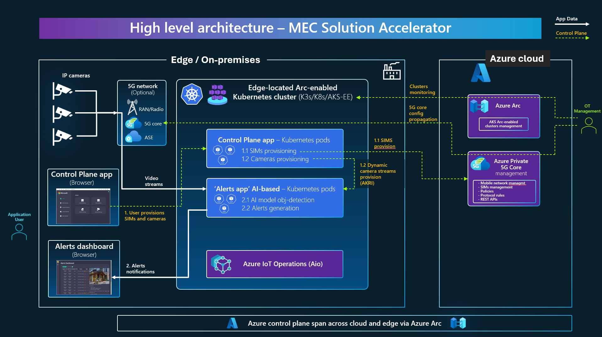
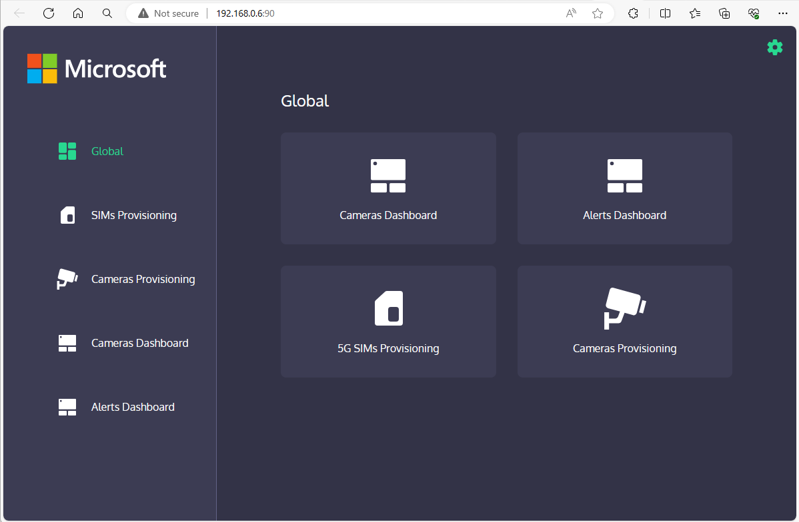
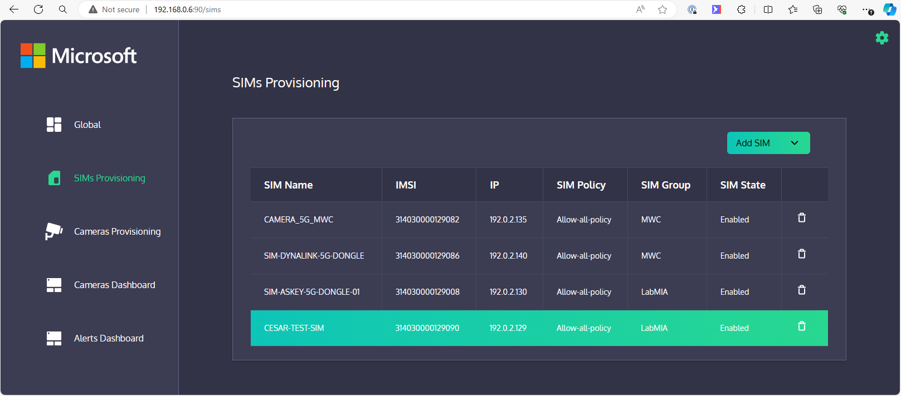
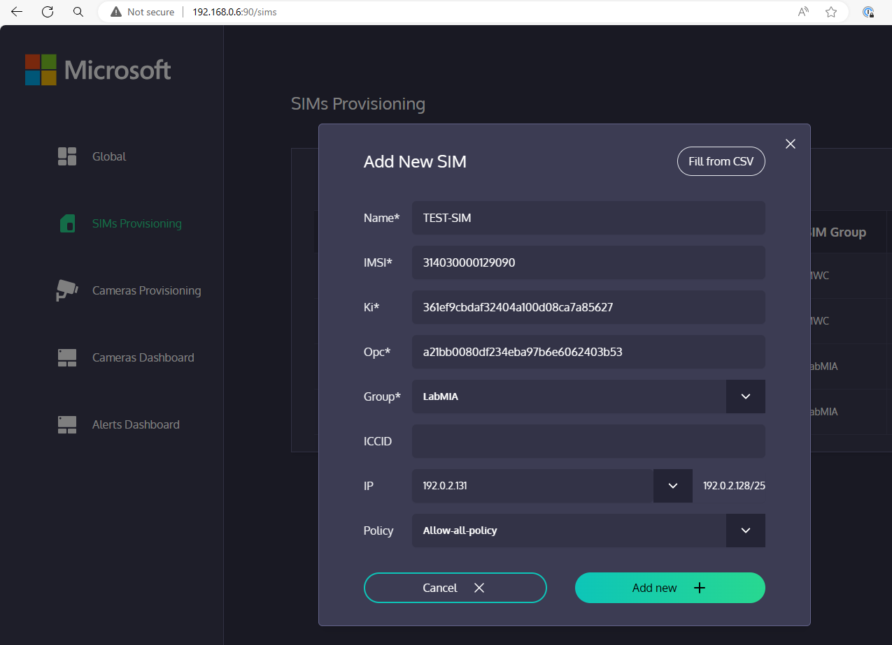
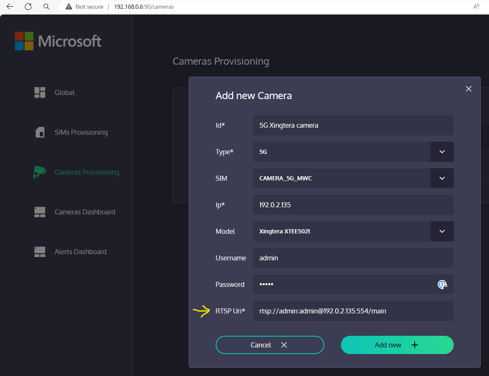
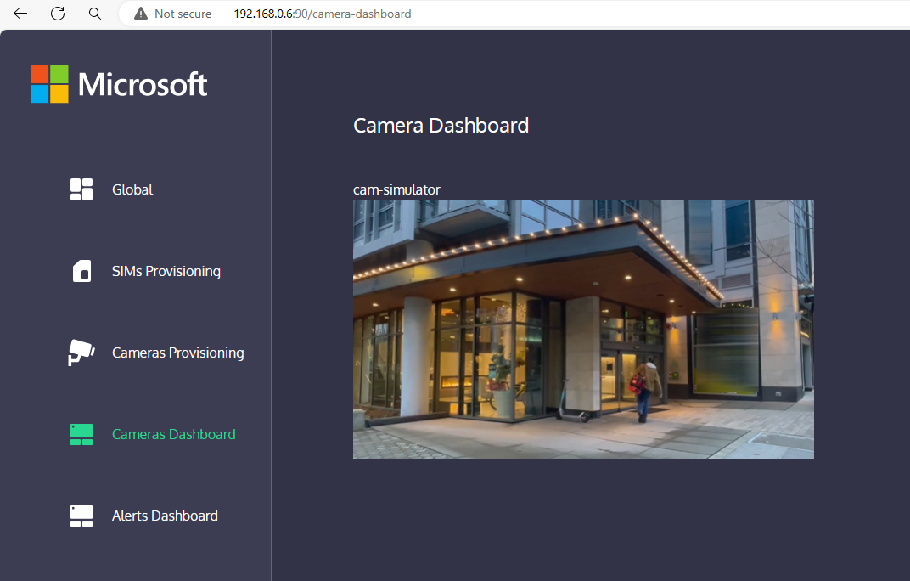
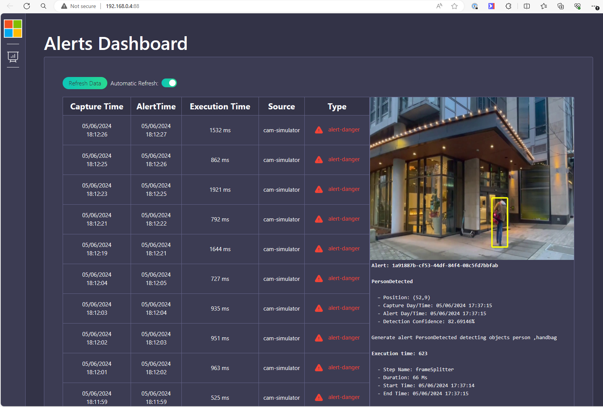

# MEC Application Solution Accelerator (Example reference application for the Edge/MEC)

Get started developing apps for 5G Private MEC (Multi-Access Edge Compute) & other Edge scenarios also including Wi-Fi, with this 'MEC Application Solution Accelerator' (OPEN SOURCE example app) based on an event-driven microservices architecture, using Docker containers, Kubernetes, Dapr and Azure IoT Operations including a MQTT message broker with Publish/Subscription to handle the events generated by AI DeepLearning models running at the edge.

The selected use case is a live video analytics (computer vision) at the edge with alerts dashboards and dynamic provisioning of any number of IP video cameras at the MEC (Multi-access Edge Compute through 5G, Wi-Fi or Ethernet), to provide real-time alerts on issues detected by AI models analyzing the video streams.

# Introduction and high level architecture

## What is a MEC Application?

A MEC Application is basically an application composed by a set of services that in order to provide the right functionality and on-time to the users it needs to run at the EDGE (very close to the data source), so it can react real-time and instantly to events happening, while being connected to devices and related acctions with very low latency end-to-end. 

In most use cases, IoT devices, video analysis and AI/Deep-Learning models to detect/predict based on the data coming from the devices, are part of this type of applications.

This new application development paradigm targeting scenarios not possible years ago is what Microsoft defines as Modern Connected Applications:

A 'MEC Application' is a subtype of application within the 'Modern Connected Applications' realm. 

Therefore, the main needs for this kind of applications are:

- Event-Driven based on light message brokers
- AI/ML models
- Low latency (Instant reaction is a must)
- High bandwidth for heavy communication (i.e. video)
- High network reliability for mission-critical
- Support for massive number of IoT devices wirelesly communicated
- Able to cover broad/large areas, wirelessly
- Dynamic and on-demand network QoS 

The network related needs are usually provided by environments such as 5G Private MEC and 5G Public MEC, but Wi-Fi and cabled network are also possible and complementary.

Check out this blog post for additional explanations: https://aka.ms/buildwith5G

## Goals for the 'MEC app solution accelerator' (This example application)

As mentioned, the network needs are provided by the infrastructure such as a 5G network or Wi-Fi and eEdge compute. 

However, aspects such as being able to create an event-driven application (Devices-->AI-->Events-->Logic-->Alerts-->Handlers) need to be implemented by your application and it's precisely the value that this example application provides:

- Recommendations on using event-driven and microservices architecture explained by this example implementation.
- Showcase of design patterns to implement (Event Pub/Sub, microservices autonomy, extensible events/alerts metadata schemas, etc.).
- Show how to inference with deep-learning models from a microservice, such as 'Yolo', for video/image analytics, then generate the related detection event.

The initial use case is about video analytics, but video analytics / computer vision is not the main goal of this example application but to provide a "backbone" to create your own event-driven microservice application running at the EDGE, on Kubernetes. This "backbone" is also applicable for other types of data processing such as data coming from IoT sensors that need to be automatically analyzed by AI models and events/alerts raised if needed.

> **DISCLAIMER:** This is an example application providing patterns, approaches and best practices targeting applications to be deployed at MEC/EDGE. 
> However, this is still an example application with no "production-ready" code but just for exploring architecture and implementation approaches.
> This application's code will be evolving, new features will be added and growing in the spirit of improving its quality thanks to open source contributions (PRs) from you.

# High level modules architecture

The solution involves the following high level modules or related applications:

- A control-plane application in charge of:
  - Dynamically provision video cameras (n cameras).
  - (Optional) Dynamically provision of related 5G SIMs, if using a 5G network with Azure Private 5G Core.

- A video analytics and event-driven alerts system in charge of:
  - Scalable video stream ingestion (n streams).
  - Scalable object/issue detection based on an AI model.
  - Alert rules engine to determine if an event should be really an alert.
  - Alerts dashboard UI.

  Below you can see a high-level diagram with the above modules and interaction:

You can see how the control plane app drives the actions related to provisioning assets such as cameras or SIMs (dotted lines in yellow), while the 'Alert app' is the live system consuming the video streams and detecting issues/alerts with the AI model (lines in white).

# Internal software architecture of the MEC Aplication Solution Accelerator

The internal software architecture (event-driven and microservice oriented architecture) and development technology details are explained in further details in this page link:

[MEC-Accelerator Internal Software Architecture details](./docs/ARCHITECTURE_MEC_ACCELERATOR.md)

## Functional features of the application

You can get an overview of this application's functionality by watching the following video.

IMPORTANT: Note that the 5G cellular network is optional. You can also try this application with Wi-Fi, Ethernet cameras and even a camera simulator with an RTSP video stream Docker container.

<video src="https://private-user-images.githubusercontent.com/1712635/329047025-3dfdf79c-d3b1-493b-935b-6cb52d7a9729.mp4" controls="controls" style="max-width: 640px;">
</video>

The application provides two main functional UI areas, showcased below.

## Control Plane app UI

The home page of this app basically shows you the main actions you can do from here:

### (OPTIONAL) 5G SIMs provisioning

As mentioned, this configuration is optional. If you are not using any cellular 5G network, you can also use Wi-Fi or ethernet, as alternatives.

When you click on the 'SIMs Provisioning' menu option, the application will show you the list of SIMs already provisioned in your Azure Private 5G Core network. That information is coming directly from Azure Private 5G Core thorugh its REST APIs.

The value-added provided by this UI integrated to Azure Private 5G Core is that any regular business application operator can provisiong SIMs without having access to the Azure subscription/portal as an administrator or technical person.

User operators can easily delete or add new SIM cards to the cellular 5G network by providing the typical SIM data:

It's very straightforward because even the IP to be provided comes from the a query to AP5GC with a pool of available IPs. Also the available SIM groups and SIM Policies to assign to.

### IP video cameras dynamic provisioning

The most important asset to provision are the video cameras. This application allows to dynamically provision 'n' number of IP cameras without having to update any code or configuration settings. A user can directly do it from the UI and the pods in Kubernetes will dynamically support the new stream ingestion, as in the following screenshot:

The important camera's value in there is the RTSP Uri. The rest of the values are simply to make it easier to construct the Uri, but if you know the Uri of your IP camera, you can also directly provide it, including Wi-Fi or Ethernet IP cameras, not just 5G cellular cameras.

Once you add any camera to the system you can check that it's working in the 'Cameras dashboard' page:

## Alerts dashboard app UI

Finally, but as the most important feature of this application, you can see the alerts being triggered originally detected by the AI model analyzing the video, as in the below screenshot which is detecting a person and showing that fact within a bounding-box:

Since these alerts are internally defined as messages going through a MQTT broker following a Publish/Subscription pattern, you could easily extendthis application and propagate these alerts as emails, text messages or to any other business system related to alerts.

# Supported application deployment alternatives 

| | |
|--------|--------|
| **"Production" environment:** | On any Kubernetes cluster typically deployed at Edge compute, such as on-premises AKS Edge Essentials, AKS from Azure Stack HCI / Arc-Enabled or K3s on Ubuntu Linux or even in AKS in Azure cloud for a testing environment. (Note: We mean a hypothetical "production" environment, since this is an example app.) |
| **Development environment:**  | On any local Docker host, with 'docker compose' directly from a console command prompt (Windows/Linux/MacOS) or from Visual Studio in Windows (running Docker host with Linux, under the covers), for easy testing and development in dev environments. |

A typical deployment of this application/services would be performed at the Edge, such as in a 5G Private MEC, using a wireless 5G network to connect the devices, cameras, etc. to the application's services. However, this application can be tested by itself without any specific network requirement (you can try it on a single laptop/computer!).

## Deployment alternatives for Kubernetes ("Production" environment)

This example  microservices application is supported on the following deployment combination alternatives for different distros and host operating system:

We have grouped the multiple combination alternatives in two different and alternative setup procedure docs.

We recommend to get started with the simplified setup based on the script:

| | | |
|--------|--------|--------|
|  | [**Alternative A. Simplified setup** with application deployment script](./docs/APP_K8S_K3S_SIMPLE_DEPLOYMENT_WITH_SCRIPT.MD) | The infrastructure installation is the same but the application components deployment is simplified with a single Script (For Windows PowerShell of for Linux Bash) |
|  | [**Alternative B. Step-by-step** application components deployment](./docs/APP_K8S_K3S_STEP_BY_STEP_DEPLOYMENT.MD) | The infrastructure installation is the same but in this case the application components are deployed one by one into Kubernetes so developers can know what's going on under the covers |
| | | |

## Local Docker deployment alternatives (Development and Test environment)

When developing, testing and debugging the MEC application it's easier and more straightforward to deploy into Docker so, for instance, you can debug code with Visual Studio and can easily test the application with just Docker installed without further setup steps as required by Kubernetes.

| | |
|--------|--------|
|  | **Deploy application services to [Docker for Desktop with 'docker compose up'](./docs/DOCKER_COMPOSE_DEPLOYMENT.MD)** |
|  | **Deploy application services to Docker with [Visual Studio (F5 experience)](./docs/VS_DOCKER_DEPLOYMENT.MD)** |
| | |

# Provisioning and customizing

In order to test your own scenarios you might want to try the following operations even before customizing or forking the application's code:

| | |
|--------|--------|
|  | **[How to provision the out-of-the-box camera simulator RTSP feed container/pod](/docs/HOW_TO_PROVISION_RTSP_CONTAINER.MD)** |
|  | **[How to provision your own real video camera RTSP feed in the app](/docs/HOW_TO_PROVISION_NEW_CAMERA.MD)** |
|  | **[How to use your own 'classes' to be detected by the AI model](/docs/HOW_TO_USE_OWN_MODEL_CLASSES.MD)** |
|  | **[How to scale up the number of pods in Kubernetes deployment configuration](/docs/HOW_TO_SCALE_UP_K8S_PODS.MD)** |
| | |

# Contributing

> PLEASE Read our [branch guide](BRANCH-GUIDE.MD) to know about our branching policy when contributing with PRs.
> **Note for Pull Requests (PRs):** We accept pull requests from the community. When doing it, please do it onto the DEV branch which is the consolidated work-in-progress branch. Do not request it onto MAIN branch. 

This project welcomes contributions and suggestions.  Most contributions require you to agree to a
Contributor License Agreement (CLA) declaring that you have the right to, and actually do, grant us
the rights to use your contribution. For details, visit https://cla.opensource.microsoft.com.

When you submit a pull request, a CLA bot will automatically determine whether you need to provide
a CLA and decorate the PR appropriately (e.g., status check, comment). Simply follow the instructions
provided by the bot. You will only need to do this once across all repos using our CLA.

This project has adopted the [Microsoft Open Source Code of Conduct](https://opensource.microsoft.com/codeofconduct/).
For more information see the [Code of Conduct FAQ](https://opensource.microsoft.com/codeofconduct/faq/) or
contact [opencode@microsoft.com](mailto:opencode@microsoft.com) with any additional questions or comments.

# Trademarks

This project may contain trademarks or logos for projects, products, or services. Authorized use of Microsoft 
trademarks or logos is subject to and must follow 
[Microsoft's Trademark & Brand Guidelines](https://www.microsoft.com/en-us/legal/intellectualproperty/trademarks/usage/general).
Use of Microsoft trademarks or logos in modified versions of this project must not cause confusion or imply Microsoft sponsorship.
Any use of third-party trademarks or logos are subject to those third-party's policies.
