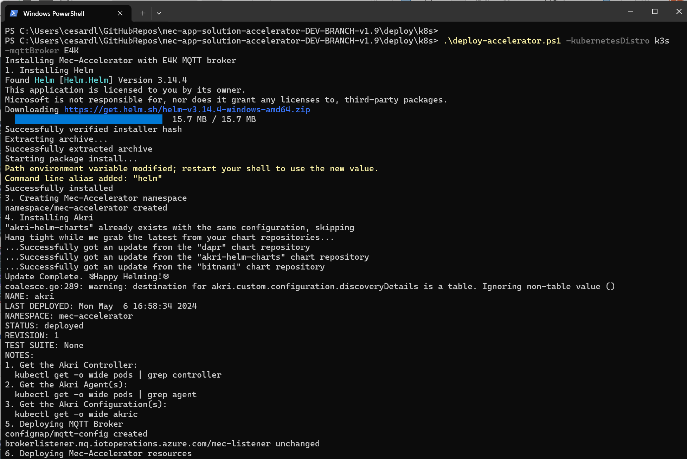
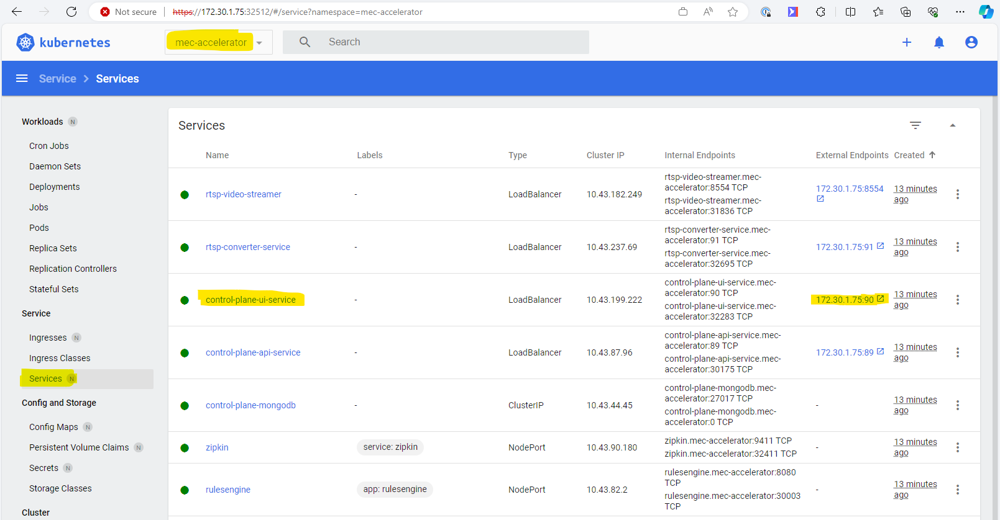
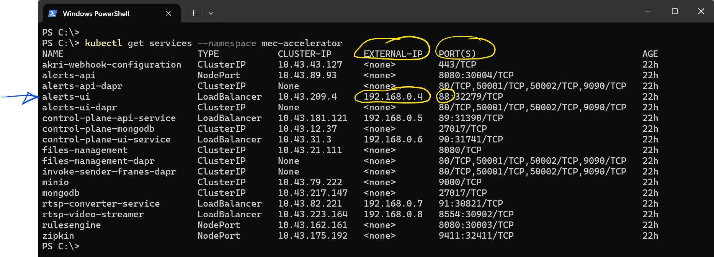
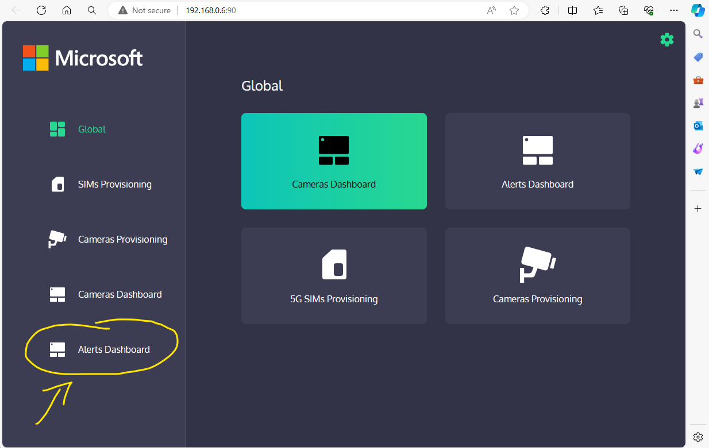
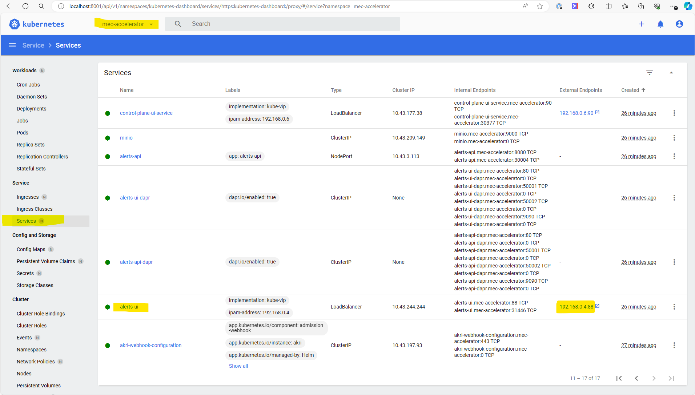
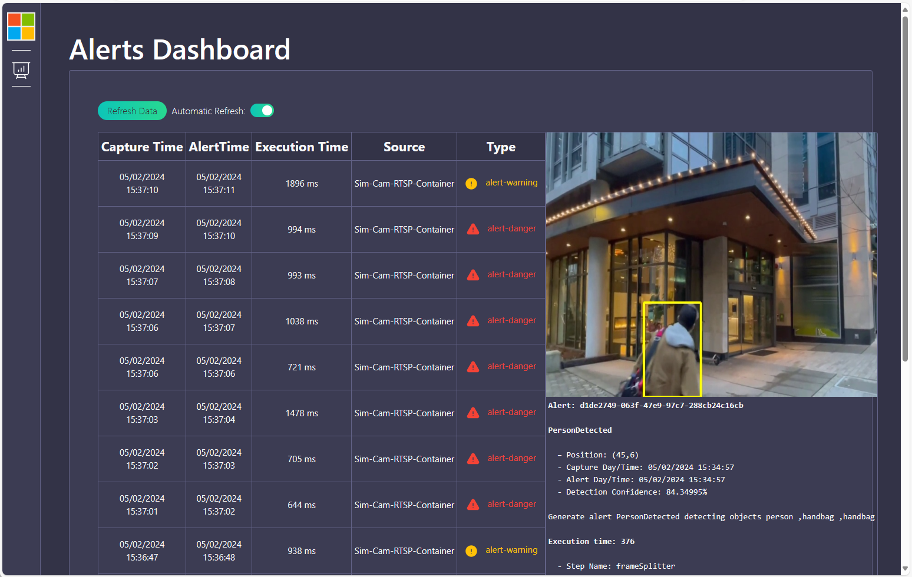

# Simplified setup with application deployment script into AKS-EE-Windows or k3s-Ubuntu-Linux

## Supported environment infrastructure at the edge

This version of MEC-App-Accelerator supports the following Kubernetes distributions and host operating system.

- **AKS Edge Essentials on Windows**
- **K3s on Ubuntu Linux**

**Kubernetes from Docker-Desktop** is not supported by Azure IoT Operations, however, if using the below OSS/Mosquito alternative, it should also work for you, but we recommend the above environments since those are the tested environments by our team.

Supported edge components on top of the Kubernetes/k3s cluster:

- **Azure IoT Operations alternative**
    - Azure IoT MQ as messaging broker
    - AKRI for dynamic cameras provissioning (OSS version)

- **Plain OSS alternative**
    - Eclipse Mosquitto as messaging broker
    - AKRI for dynamic cameras provissioning (OSS version)


## Install the Kubernetes/K3s cluster at the edge

Install the AKS-EE-Windows cluster or the K3s-Ubuntu cluster by following the instructions in the below Microsoft official doc.

Even when the below documentation link is the supported baseline environment for an Azure IoT Operations cluster, you can also follow this AKS-EE/K3s cluster installation procedure documentation even if you won't use the Azure IoT Operations alternative but the plain OSS/Mosquitto alternative:

**Install AKS-EE-Windows alternative:** 

[Create your Azure Arc-enabled Kubernetes cluster on Windows](https://learn.microsoft.com/en-us/azure/iot-operations/deploy-iot-ops/howto-prepare-cluster?tabs=aks-edge-essentials)

**Install K3s-Ubuntu-Linux alternative:** 

[Create your Azure Arc-enabled K3s cluster on Ubuntu-Linux](https://learn.microsoft.com/en-us/azure/iot-operations/get-started/quickstart-deploy?tabs=linux#connect-a-kubernetes-cluster-to-azure-arc)

**IMPORTANT** If you are NOT going to use Azure IoT Operations, when following the previous setup doc, stop before the section named *"Deploy Azure IoT Operations"*. Hence, the last secion to follow should be *"Verify cluster"*.

## Install Azure IoT Operations into your cluster

**Note:** You only need to install Azure IoT operations if you want to use Azure IoT MQ (aka. E4K) instead of Mosquitto, as your selected selected MQTT broker.
For using AKRI, since we're curently using the OSS version of AKRI, it can be installed on any Kubernetes cluster without needing to have Azure IoT Operations installed.

### Prerequisites for Azure IoT Operations

It's important to check and install the prerequisites for Azure IoT Operations explained here:

[Prerequisites for Azure IoT Operations](https://learn.microsoft.com/en-us/azure/iot-operations/get-started/quickstart-deploy?tabs=windows#prerequisites)

### Deploy Azure IoT Operations

Install Azure IoT Operations by following the official "simplified/automated approach" documentation here:

[Deploy Azure IoT Operations Preview](https://learn.microsoft.com/en-us/azure/iot-operations/get-started/quickstart-deploy?tabs=windows#deploy-azure-iot-operations-preview)

When deploying Azure IoT Operations by following the above documentation link, you should see a console app similar to the following execution:


## Deploy the MEC-Application into the cluster (With deployment script)

There are a few prerequisites and steps for the application itself, explained in the following sections.

### Clone the MEC-Accelerator GitHub repo

You need to clone the MEC-Accelerator GitHub repo in the client machine from where you will deploy the application against your Kubernetes/k3s cluster.

Basically, you need to have the cloned repo in the same machine from where you also use KUBECTL against your K8s/K3s cluster.

Logically, you need to have [installed Git](https://git-scm.com/downloads) in the first place.

Then, using a command-line tool (PowerShell in Windows or Bash in Linux) clone the repo:

```
git clone https://github.com/Azure/mec-app-solution-accelerator.git
```

**TEMPORAL NOTE:** Until v2 is in the **main branch**, please use the branch **"mec-accelerator-aio-dev"** by positioning within the folder of the cloned repo and running this command:

```
git checkout mec-accelerator-aio-dev
```

### Move to the deployment folder

From the console, move to the deployment folder within the cloned repo:

```
cd <YOUR PATH>/deploy/k8s
```

### (OPTIONAL) Update the application control plane configuration for accesing your Azure Private 5G network

Update the config map that contains essential information for connecting to our Azure Mobile Network. You'll find the configuration in the file `deploy/k8s/13-control-plane-api-config-map.yaml`.

Replace the following values in the file:

```
  MobileNetwork__SubscriptionId: "your_subscription_id"
  MobileNetwork__ResourceGroup: "your_resource_group"
  MobileNetwork__Name: "your_network_name"
  MobileNetwork__AttachedDataNetwork: "your_attachedDataNetwork_fullID"
  MobileNetwork__Slice: "your_slice_fullID"
  ClientCredentials__TenantId: "your_tenant_id"
  ClientCredentials__ClientId: "your_client_id"
  ClientCredentials__ClientSecret: "your_client_secret"
```

*Note:* This step is required if you want to manage SIMs provisioning from this app against AP5GC (Azure Private 5G Core) in Azure. 
For just getting alerts and camera management/provisioning (i.e. Wi-Fi or Ethernet cameras provisioning), you can skip this part if you don't have an AP5GC Mobile Network and packet core deployed into an ASE, RAN, 5G UEs, etc.

### Check your kubectl context

Make sure that your default kubectl context is pointing to the right cluster: 

Open a new command-shell and run the following command to check your current contexts:

```powershell
kubectl config get-contexts
```

To set the context to point to the right Kuberentes cluster, use kubectl and provide the name of the context to use:

```powershell
kubectl config use-context [my-cluster-context]
```

### Run the application deployment script

Within the `deploy/k8s` folder there are two Script files, one for Windows and one for Linux that handle the application  deployment into the cluster, including dependencies such as Dapr and AKRI.

The script will run the following deployment steps:

- Install Dapr and Helm.
- Initialize mec-accelerator namespace in the cluster where all the resources will be deployed.
- Install Akri with the specific version depending on the Kubernetes distro used (k8s/k3s).
- Deploy the selected MQTT broker.
- Deploy the rest of the accelerator resources (microservices pods).

The script needs two arguments to be provided depending on the cluster type and the MQTT broker selected:

- **Kubernetes distro:** The `kubernetesDistro` parameter supports Kubernetes and K3s. Supported choice arguments are `k8s` and `k3s`.

- **MQTT broker:** The `mqttBroker`  parameter supports Azure IoT MQ broker (aka. E4K) and Mosquitto. Supported choice arguments are `E4K` and `mosquitto`.

Note that if using Azure IoT MQ broker, **Azure Arc** and **Azure IoT Operations** must be installed in the cluster based on the provided initial instructions above.

**IMPORTANT:** The application setup script has to be executed on the same machine/environment where you would typically run KUBECTL against your cluster, so it can be on the same cluster's machine (i.e. where you have installed AKS Edge Essentials) or on any client machine able to use KUBECTL against your k3s/Ubuntu-VM cluster.

#### OPTION A: Execute the script in Windows

Execute the script `deploy-accelerator.ps1` while providing the selected parameters:

**ALTERNATIVE A.a:** For deploying with Azure IoT MQ (aka.E4K) into AKS Edge Essentials or a plain K3S in a Windows box, the command is the following:

```powershell
.\deploy-accelerator.ps1 -kubernetesDistro k3s -mqttBroker E4K
```

**ALTERNATIVE A.b:** For deploying with Mosquitto into AKS Edge Essentials or a plain K3S in a Windows box, the command is the following:

```
.\deploy-accelerator.ps1 -kubernetesDistro k3s -mqttBroker mosquitto
```


#### OPTION B: Execute the script in Linux

Execute the script `deploy-accelerator.sh` while providing the selected parameters: 

**ALTERNATIVE B.a:** For deploying with Azure IoT MQ (aka.E4K) into AKS Edge Essentials or a plain K3S in an Ubuntu-Linux box, the command is the following:

```powershell
./deploy-accelerator.sh --kubernetesDistro k3s --mqttBroker E4K
```

**ALTERNATIVE B.b:** For deploying with Mosquitto into AKS Edge Essentials or a plain K3S in an Ubuntu-Linux box, the command is the following:

```powershell
./deploy-accelerator.sh --kubernetesDistro k3s --mqttBroker mosquitto
```

Basically, the only difference in usage related to the operating system of the host should be the script file name (**.ps1** vs. **.sh**).

Here's an example of the application's setup script execution:



## Try the 'Control Plain app' to provision cameras

In order to know the URL for the 'Control Plain web app' (IP and port to use), type the following command:

```powershell
kubectl get services --namespace mec-accelerator
```


Then search for the service with name **"control-plane-ui-service"** and related IP and external port, so you write a URL similar to the following in a browser:

`http://<your-IP>:90/`


You could also find out the IP and port by using the Kubernetes dashboard, select the Kubernetes  namespace where the application is deployed ("mec-accelerator"), go to the "Services" menu in the left tab and click on the url to the right on the **"control-plane-ui-service" service** row.



## Access the Alerts dashboard UI with Alerts originated from AI model detections

To access the  front-end, 
In order to know the URL for the 'Alerts dashboard UI' front-end (IP and port to use), type the following command:

```powershell
kubectl get services --namespace mec-accelerator
```



Then search for the service with name **"alerts-ui"** and related IP and external port, so you write a URL similar to the following in a browser:

`http://<your-IP>:88/`

Alternatively, you can also click on the link "Alerts Dashboard" from the Control-Plane app here:



As a third alternative and again using the K8s dashboard, you can also find out the real URL from the K8s dashboard, select the Kubernetes namespace where the application is deployed (MEC-Accelerator), go to the services menu in the left tab and click on the url to the right on the Alerts-UI service row:



Following any of those ways you should be able to run the 'Alerts dashboard UI' and check out the Alerts originated from the AI models when analyzing the video:




## Remove the MEC-Application from Kubernetes 

- Open a new command-shell and change the current folder to the `deploy/k8s` folder of this repo.

- Run the `deploy-accelerator` script with the **uninstall** parameter to remove all related application's resources from Kubernetes.

Windows:

```powershell
.\deploy-accelerator.ps1 -uninstall
```

Linux:

```powershell
.\deploy-accelerator.sh -- uninstall
```


