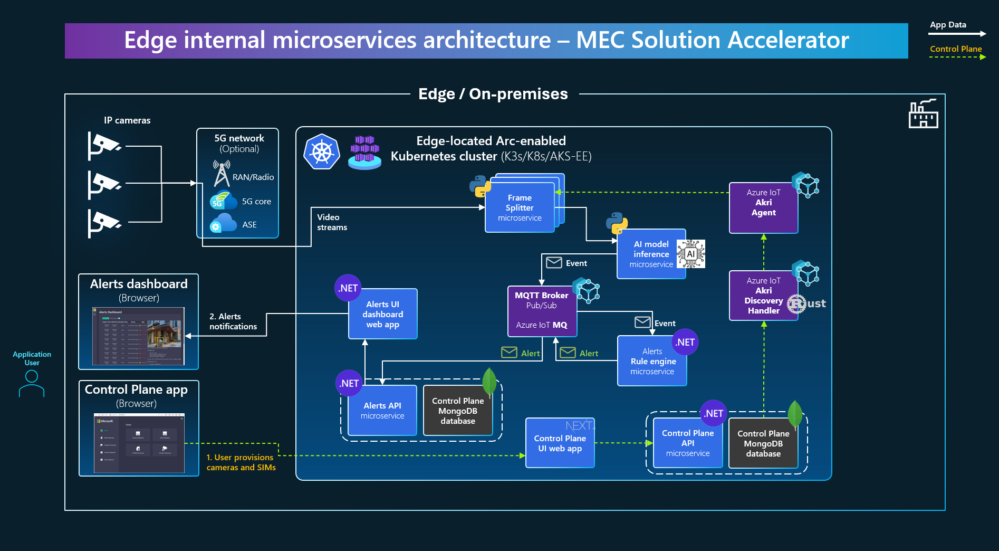

# Internal software architecture of the MEC Aplication Solution Accelerator

This reference application proposes an event-driven and microservice oriented architecture implementation with multiple autonomous microservices. 

The main goal is to ingress data from client IoT/edge devices. The initial functionality for this sample application is to ingress video from wireless cameras, analyze it with AI models, detect issues, create events and submit them to a messaging broker thorugh a Publish/Subscription approach so additional microservices evaluate if the events need to be converted to Alerts and publish the alerts to the multiple event handlers related, such as an "Alerts dashboard" app or any other integrated process that needs to react in real-time thanks to the low latency provided by the Edge.

### The 'Alerts application' software architecture

Not taking into account the dynamic provisioning of 'n' number of cameras, the below architecture diagram exposes the implemented microservices to tackle the video analytics system:

The primary deployment environment is Kubernetes or K3s, as explained in the deployment documentation.

However, the "core" part of this application (video analytics only without the dynamic camera provisioning feature) can also be deployed into a plain Docker host for development and debugging purposes since for that execution you don't need multiple instances of the same container/pod (one per camera stream) as you can have in Kubernetes, but with a single camera (single container instance for the stream processing) is enough.  

However, this is not just about 'Video analytics'. The important value of this architecture and reference applications is based on the event-driven architecture which can be very easily customized to support different types of "input data" from IoT devices, so instead of video, it coud ingress data from IoT sensors, or manufacturing machines, analyze it with different type of AI models in the same MEC's network and again generate comparable events and derived alerts with a very low latency.

Therefore, the importance of this example applications is about the event-driven design patterns implemented by using light MQTT messaging brokers and effective dedicated microservices leveraging DAPR (Microsoft's framework specialized on microservices patters) and deployed on Kubernetes so the solution can be deployed on most EDGE environments supporting Kubernetes.

### The 'Control-plane application' software architecture

The 'Control-plane application' extends the 'Alerts Application' or 'core application' by supporting dynamic provisioning of "n" number of video cameras and optionally "n" number of 5G SIMs, if using a private 5G network.

The video stream processing requires one pod/container per each camera/stream. Therefore, if you add 10 cameras, you would need 10 pods/containers processing the video stream. But how can we implement that growth dynamically?

This "dynamic provisioning" of video cameras is implemented thanks to AKRI, a component provided by Azure IoT Operations, which allows to dynamically grow the video ingestion and AI models, as shown in the below software architecture diagram:

## Supported deployments for this example application:

| | |
|--------|--------|
| **"Production" environment:** | On any Kubernetes cluster typically deployed at Edge compute, such as on-premises AKS Edge Essentials, AKS from Azure Stack HCI / Arc-Enabled or K3s on Ubuntu Linux or even in AKS in Azure cloud for a testing environment. (Note: We mean a hypothetical "production" environment, since this is an example app.) |
| **Development environment:**  | On any local Docker host, with 'docker compose' directly from a console command prompt (Windows/Linux/MacOS) or from Visual Studio in Windows (running Docker host with Linux, under the covers), for easy testing and development in dev environments. |

A typical deployment of this application/services would be performed at the Edge, such as in a 5G Private MEC, using a wireless 5G network to connect the devices, cameras, etc. to the application's services. However, this application can be tested by itself without any specific network requirement (you can try it on a single laptop/computer!).

## Technologies used

| | |
|--------|--------|
| **Azure IoT Operations:** | Components used: Azure IoT MQ (aka. E4K) as MQTT broker and Azure IoT AKRI for dynamic provisioning of video cameras stream ingestion |
| **Kubernetes:** | Supported: AKS Edge Essentials for Windows and K3s on Ubuntu Linux - Docker-Desktop-Kubernetes only for limited configurations |
| **Azure Arc:** | Used with AKS-EE and k3s Arrc enabled for edge-cluster visualization and monitoring from Azure cloud|
| **Docker host:** | For development and debugging environments. Docker host does not support Azure IoT Operations so it'd be only the application pods/containers without AKRI (no dynamic number of cameras but a single one) and using Mosquitto instead of Azure IoT MQ from Aio|
| **Dapr framework:** | Dapr is a framework specially made for microservices architectures. In this app it's mostly used for the Dapr sidecar-containers feature. |
| **AI Object Detection:** | By default "Yolo" model is used but it can be easily replaced by any custom AI model for Object Detection. |
| **Languages:** | Python for video stream ingestion service and AI model scoring. .NET/C# for domain logic services and Rust for AKRI custom code |
| **Databases:** | MongoDB for data and MinIO for Images/Frames storage |

## Optional deployment on Private 5G MEC

A typical deployment of this type of solution would be to deploy it into a **5G Private MEC** such as the one supported by **Azure Private MEC** solution and **Azure Private 5G Core (AP5GC)**, as shown in the diagram below which would define a sinple 5G Lab for a 5G Private MEC.

This MEC application Solution Accelerator (example application) would be deployed into the highlighted in yellow server/s in the following 5G Private MEC diagram:

Only what's highlighted in yellow is purely related to this MEC application Solution Accelerator (example application). The rest of the elements in the shown diagram are part of the needed 5G network infrastructure plus Azure cloud services for infrastructure management plus other optional Azure services that could be used for long term analysis and aggregation, such as Azure Data Explorerm Digital Twins and Azure Machine Learning for training new AI models, etc. 

When moving to production you would need to scale out the number of 5G RANs depending on how large is the area to cover, the number of servers for Azure Private 5G Core depending on the number of 5G network sites and the number of servers for application compute depending on the compute requirements demanded by AI models and application process which can vary depending on the number of video cameras and/or IoT devices to handle.

### "Heavy EDGE" as the selected approach for this example application

It's important to highlight that the selected approach for this example application is "centralized per EDGE site", which is called **"Heavy Edge"**, so you have a single or few sets of EDGE compute servers/appliances on-premises in central places, versus **"Heavy User Equipment Edge"** which needs one compute-machine (such as NVDIA ORIN) per camera or cluster of IoT devices. 

With **"Heavy User Equipment Edge"** because you are placing the AI models compute besides the data source, then network bandwidth needed can be much lighter in the MEC's wireless network.

However, in this project we wanted to target the "global approach" because in most cases allows a lower cost (TCO) because of a enabling a centralized management of the compute with a smaller number of compute appliances to manage because of sharing the compute with Kubernetes scalability (compute shared across many Kubernetes pods).

  
Both approaches are good approaches depending on the needs and shown below. 
"Heavy EDGE" is therefore the selected approach for this example application.

