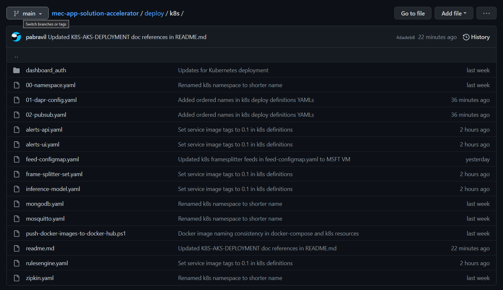
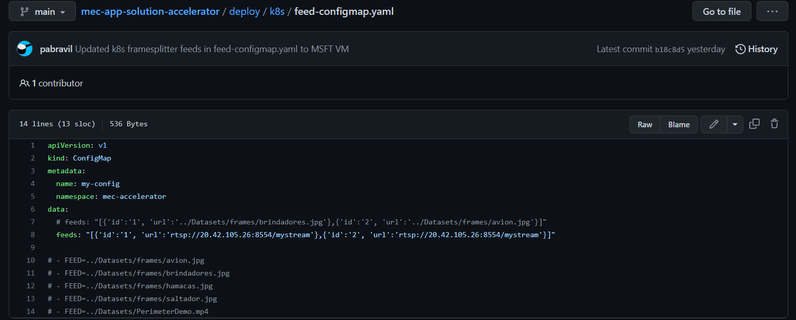

# New Feed Provision 

The current solution supports the usage of custom images and videos for testing purposes.
If you want to ru your own video in kubernetes, please refer to 
[Create RTSP Server](HOW_TO_CREATE_RTSP_SERVER.MD)

## Docker Compose

In docker-compose.override.yml find the framesplitter service.


Comment the current feed line

```
- FEED=../Datasets/PerimeterDemo.mp4
```

Uncomment and modify the rtsp url with your ip and port

```
- FEED=rtsp://20.42.105.26:8554/mystream
```

It is also possible to run your own videos using compose, if you add your video to datasets folder, and reference it correctly


```
- FEED=../Datasets/YOURFILE.mp4
```


## Kubernetes

In this case it is only possible to add a new feed using RTSP.

Navigate to the k8s folder



Modify feed-configmap.yaml



Add your new url to the tag url in the dict structure.

IMPORTANT: you must take into account that these feeds are consumed by one unique framesplitter pod. If you want two rtsp to be consumed, you have the set the replicas properly, and the system will automatically assign one rtsp feed per framesplitter replica.

If you want to modify an id or add a new one, follow the format proposed in the next line

```
feeds: "[{'id':'1', 'url':'rtsp://20.42.105.26:8554/mystream'},{'id':'2', 'url':'rtsp://20.42.105.26:8554/mystream'}]"
```


