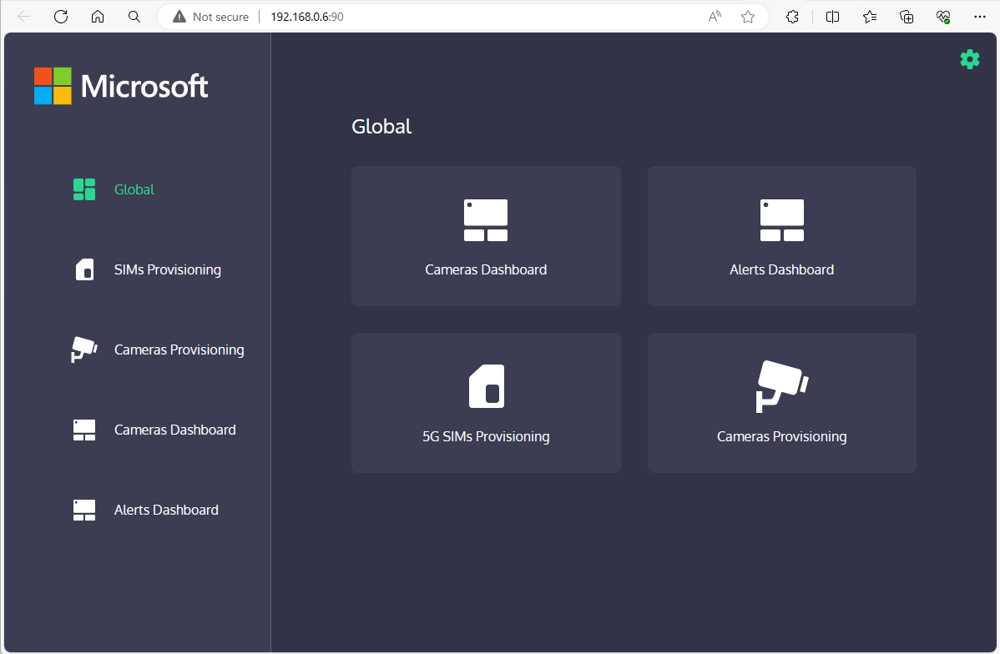

## Try the 'Control Plain app' to provision cameras

In order to know the URL for the 'Control Plain web app' (IP and port to use), type the following command:

```powershell
kubectl get services --namespace mec-accelerator
```


Then search for the service with name **"control-plane-ui-service"** and related IP and external port, so you write a URL similar to the following in a browser:

`http://<your-IP>:90/`



### Provision a camera simulator with the out-of-the-box RTSP stream container

As a first try, before trying with any real IP camera, you can test the solution with our out-of-the-box camera simulator which is a Docker container that is streaming a video through RTSP.

In order to provision such "camera simulator", click on the "Cameras Provisioning" menu option, then "Add new Camera".

In that dialog, write a name for that camera simulator, select "Container" as the Type and finally select "Default RTSP Stream Container" as the Model.
With that, the app will automatically select the internal IP used in Kubernetes for the RTSP pod (IP = "rtsp-video-streamer") and it will also automatically generate its related RTSP Uri:


After that you can check that the video stream is working by clicking to the "Cameras Dashboard" menu option so you should see it like the following:


**Important:** Note that the cameras dashboard intended use is just to check that the camera streams are working properly. This dashboard is not working with the object detection AI model. The object detections and alerts are shown in the "Alerts Dashboard".


### Access the Alerts dashboard UI with Alerts originated from AI model detections

To access the  front-end, 
In order to know the URL for the 'Alerts dashboard UI' front-end (IP and port to use), type the following command:

```powershell
kubectl get services --namespace mec-accelerator
```


Then search for the service with name **"alerts-ui"** and related IP and external port, so you write a URL similar to the following in a browser:

`http://<your-IP>:88/`

Alternatively, you can also click on the link "Alerts Dashboard" from the Control-Plane app here:


Following any of those ways you should be able to run the 'Alerts dashboard UI' and check out the Alerts originated from the AI models when analyzing the video:


