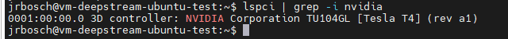

# Deploy the application to Ubuntu (laptop/desktop/edge server)

A real production scenario can be composed by physical computer close to the cameras at the edge zone. It can be a Linux server or even a desktop computer at the office. Assuming this computer has an Ubuntu OS, you can deploy the application on a lightweight Kubernetes cluster (k3s).

If your PC has attached a NVIDIA GPU card supported by DeepStream toolkit you can also export the GPU resources to the Kubernetes cluster and take advance of the DeepStream implementation.


## Install NVIDA drivers.

1. Check if you have an NVIDA device.

    ```bash
    lspci | grep -i nvidia
    ```

This commnad should output the NVIDA GPU brand model like this:



2. Install OS requirements.

    Build toolchain that include gcc and build dependencies.

    ```bash
    sudo apt install build-essential
    ```

    Kernel headers.

     ```bash
    sudo apt-get install linux-headers-$(uname -r)
    ```

3. NVIDIA Driver.

    NVIDIA repository installation for Ubuntu.

    ```bash
    wget https://developer.download.nvidia.com/compute/cuda/repos/ubuntu2204/x86_64/cuda-keyring_1.1-1_all.deb
    sudo dpkg -i cuda-keyring_1.1-1_all.deb
    ```

    Update the Apt repository cache.

     ```bash
    sudo apt-get update
    ```

    Install CUDA SDK.

    ```bash
    sudo apt-get install cuda-toolkit
    ```

    To include all GDS packages:

    ```bash
    sudo apt-get install nvidia-gds
    ```

    Install the driver

    ```bash
    sudo apt-get install cuda-drivers
    ```

    Reboot the system

    ```bash
    sudo reboot
    ```

4. NVIDIA driver validation

    When the driver is loaded, the driver version can be found by executing the command:

     ```bash
    cat /proc/driver/nvidia/version
    ```

## Installing the NVIDIA Container Toolkit

5. Install the NVIDIA Container Toolkit repository.

    ```bash
    curl -fsSL https://nvidia.github.io/libnvidia-container/gpgkey | sudo gpg --dearmor -o /usr/share/keyrings/nvidia-container-toolkit-keyring.gpg \
      && curl -s -L https://nvidia.github.io/libnvidia-container/stable/deb/nvidia-container-toolkit.list | \
        sed 's#deb https://#deb [signed-by=/usr/share/keyrings/nvidia-container-toolkit-keyring.gpg] https://#g' | \
        sudo tee /etc/apt/sources.list.d/nvidia-container-toolkit.list
    ```
    (Optional) Install the experimental NVIDIA Container Toolkit repository.

    ```bash
    sed -i -e '/experimental/ s/^#//g' /etc/apt/sources.list.d nvidia-container-toolkit.list
    ```

    Update the Apt repository cache:

     ```bash
    sudo apt-get update
    ```

    Install the NVIDIA Container Toolkit

     ```bash
    sudo apt-get install -y nvidia-container-toolkit
    ```

## Install and configure Docker Engine to use the nvida-container-toolkit

6. Install using the convenience script.

    ```bash
    curl -fsSL https://get.docker.com -o get-docker.sh
    sudo sh ./get-docker.sh
    ```

    Add your user to the docker group and then log out and log back in so that your group membership is re-evaluated.

    ```bash
    sudo usermod -aG docker $USER
    logout
    ```

    When running ``kubernetes`` with ``docker``, edit the config file which is usually present at ``/etc/docker/daemon.json`` to set up nvidia-container-runtime as the default low-level runtime:

    ```bash
    {
        "default-runtime": "nvidia",
        "runtimes": {
            "nvidia": {
                "path": "/usr/bin/nvidia-container-runtime",
                "runtimeArgs": []
            }
        }
    }
    ```

    And then restart docker:

    ```bash
    sudo systemctl restart docker
    ```

## Install k3s with docker as container runtime

7. Use the QuickStart script

    ```bash
    curl -sfL https://get.k3s.io | sh -s - --docker --write-kubeconfig-mode 644
    ```

### Check kubectl context

8. If you previosly had already installed kubectl and it is pointing to some other environment, make sure the default kubectl context is pointing to your new k3s installation.

    ```bash
    kubectl config get-contexts
    ```

8. To set the context to point to k3s defualt context:

    **If using K3s:**

    ```bash
    kubectl config use-context default
    ```

### Install NVIDIA device plugin for Kubernetes

The NVIDIA device plugin for Kubernetes is a Daemonset that allows you to automatically:

* Expose the number of GPUs on each nodes of your cluster
* Keep track of the health of your GPUs
* Run GPU enabled containers in your Kubernetes cluster.

    ```bash
    kubectl create -f https://raw.githubusercontent.com/NVIDIA/k8s-device-plugin/v0.14.3/nvidia-device-plugin.yml
    ```

### Install and Initialize Dapr

This example application is based on **[Dapr](https://dapr.io/)** framework which is an OSS Microsoft framework specialized on microservices architecture, so you need to install it and enable in the Kubernetes cluster, first.

9. Install or make sure you have installed `Dapr` on your machine on a Kubernetes cluster as described in the [Deploy Dapr](https://docs.dapr.io/operations/hosting/kubernetes/kubernetes-deploy/#install-with-dapr-cli).

    Note that if you were able to run the application on plain Docker, you should have installed DAPR already, but it needs to be initialized in Kuberentes, now.

10. DAPR seems to use ``--kubeconfig`` parameeter pointing to ``$HOME/.kube/config`` at the cluster installation time. So you need to copy your ``kubeconfig`` file to this loctation.

    ```bash
    sudo cp /etc/rancher/k3s/k3s.yaml $HOME/.kube/config
    sudo chown $USER.$USER $HOME/.kube/config
    ```

11. Initialize DAPR in the Kubernetes cluster by running this command:

    ```bash
    dapr init -k
    ```

    **IMPORTANT:** This **[Dapr](https://dapr.io/)** installation option is okay for a dev machine, but when installing **[Dapr](https://dapr.io/)** on a "production" AKS cluster, for example in an ASE (Azure Stack Edge) server, you need to install **[Dapr](https://dapr.io/)** via AKS extension following the Doc: (https://learn.microsoft.com/en-us/azure/aks/dapr) which is how **[Dapr](https://dapr.io/)** should be installed in controlled environments since it doesn’t require cluster admin access.

    You can test DAPR status with:
    ```bash
    dapr status -k
    ```

    If DAPR is initialized, you should get this list of Dapr pods running:

    You can also check the pods running with this kubectl command:

    ```bash
    kubectl get pods --namespace dapr-system
    ```

### Deploy the application's services to Kubernetes

12. Move into the `deploy/k8s` folder of this repo, as current folder of the command-shell:

    ```bash
    cd <your_path>/deploy/k8s
    ```

10. Deploy the application in Kuberentes by running common deployments with cpu **or** gpu deployments

    ```bash
    kubectl apply -f ./common/
    ```
    No GPU support
    ```bash
    kubectl apply -f ./cpu/
    ```

    GPU support (NVIDIA Deepstream implementation)

    **Note:** The DeepStream docker image size is more than **10GB**, ``kubelet`` could fail pulling big images if it is not configured for this purpose. Instead of change the ``kubelet`` default configuration you can pull the DeepStream images with ``Docker CLI`` and then execute the gpu deployment.

    ```bash
    docker pull mecsolutionaccelerator/deepstream:0.2_amd64
    ```

    ```bash
    kubectl apply -f ./gpu/
    ```

    All services will be created in the specified Kubernetes namespace "mec-accelerator" for this application.

    You can also check the pods running with this kubectl command:

    ```bash
    kubectl get pods --namespace mec-accelerator
    ```

    **Note:** The DeepStream docker image size is more than 10GB, kubelet could faild pulling big images if it is not configured for this purpose.


    When you are finished trying the application, you can always uninstall the application pods and all related resources from your Kuberentes by running this command:

    ```bash
    kubectl delete -f ./cpu/ && kubectl delete -f ./common/
    ```

    Or

    ```bash
    kubectl delete -f ./gpu/ && kubectl delete -f ./common/
    ```
