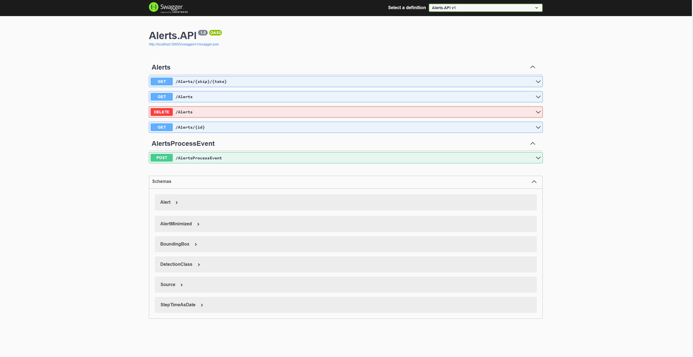

# Clean Mongo DB

## Locally
To clean up the database locally there are two options:
Remove the "database" folder contained in mongodb with the solution stopeed.


Use the delete endpoint in swagger which deletes the alerts collection.



## In kubernetes

1. Use Azure CLI to log in and set the apropiate subscription where the AKS cluster is located

    To check your current contexts:

    ```powershell
    az login
    az account set -s SUBSCRIPTION_ID
    ```

2. Get credentials and set the kubectl context using az `aks get-credentials -r -n`:

    To check your current contexts:

    ```powershell
    az aks get-credentials --resource-group YOUR_RG_GROUP --name YOUR_AKS_NAME
    ```

    


    Alternatively, check and set your current contexts using kubectl config:

        ```powershell
        kubectl config get-contexts
        ```

        ```powershell
        kubectl config use-context DESIRED_CLUSTER
        ```

3. Create a tunnel with the alerts-api pod using kubectl command:

        kubectl port-forward svc/alerts-api 8080:8080 -n mec-accelerator

4. Clean the alerts collection using the delete endpoint.

