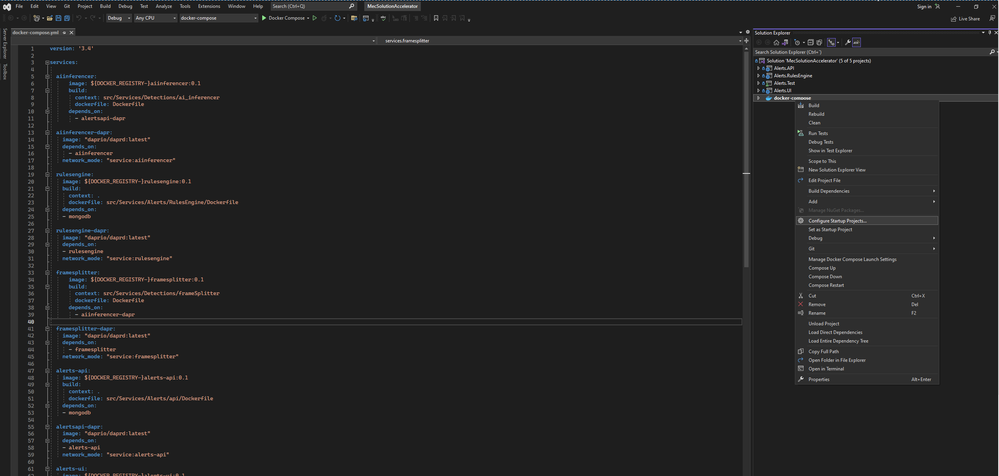

# Deploy on Docker ('Visual Studio F5 experience')

Make sure you have [installed](https://docs.docker.com/desktop/install/windows-install/) and configured docker in your environment. After that, you can run the below commands from the solution's root directory and get started trying it.

## Grab the GitHub repo code

Get the GitHub repo's code:

```powershell
git clone git@github.com:Azure/mec-app-solution-accelerator.git
```

## (Optional step) Set the DOCKER_REGISTRY environment variable

Before creating the Docker images it's important to setup the DOCKER_REGISTRY environment variable in your dev system (Windows / Linux) so the images will be created with the right prefix (i.e. Docker hub user). This is important if you later want to use the same Docker images to upload them into Docker Hub or any other Docker Registry from where you will deploy the images to Kuberentes.

Here you have additional information on why and [How to setup the DOCKER_REGISTRY environment variable](./docs/SET_DOCKER_REGISTRY_VARIABLE.MD).

But if you just want to try the solution with `docker compose up` or Visual Studio, this step is optional, as it should work locally, anyways.

## Change the default start project
Opem the solution, and open the solution explorer window, right-click on the docker-compose project, and in the context menu that appears, select "Set as StartUp Project". 



Docker compose project will now be the new default startup project of the solution.

## Start the solution
Now that we have established the appropriate startup project, we will recompile the solution, and start it. 


After a few seconds, depending on the capacity of the device, the alert dashboard should open in our browser with url https://localhost:50058/ or https://host.docker.internal:50058/ .


You can also open the Alerts API swager at the following urls: http://localhost:50055/swagger/index.html http://host.docker.internal:50055/swagger/index.html , using this swagger you can query the alerts, and more importantly, you can delete the alerts collection, when too many are stored.


## Ports configuration

Remember than you can change the external ports configuration, or the rtsp source, in the docker.compose.override.yaml.

